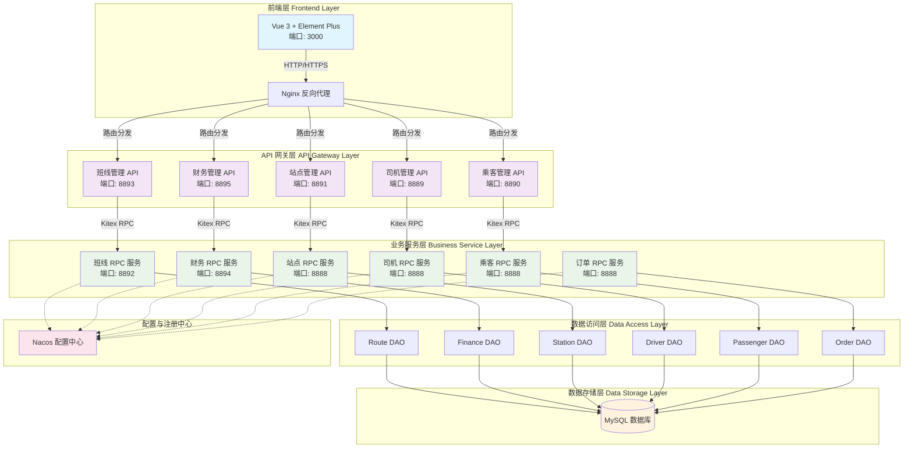
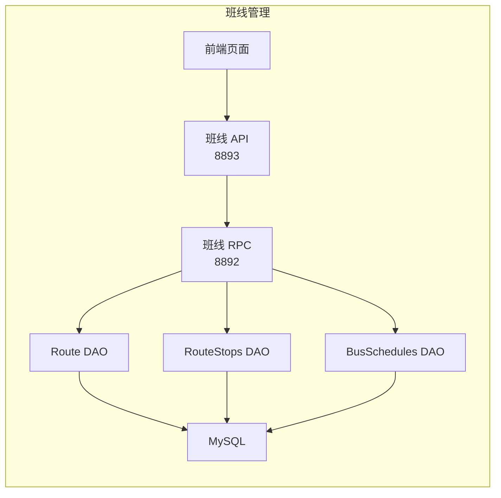
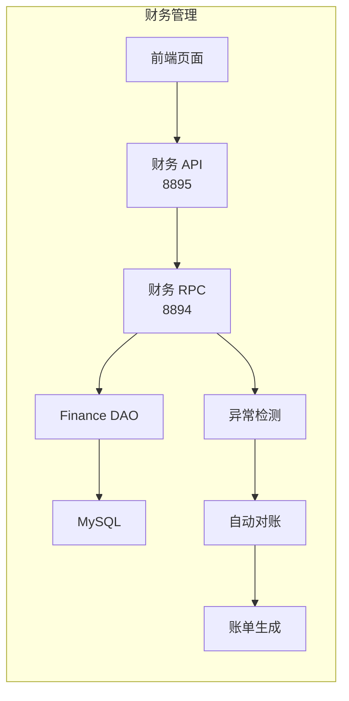
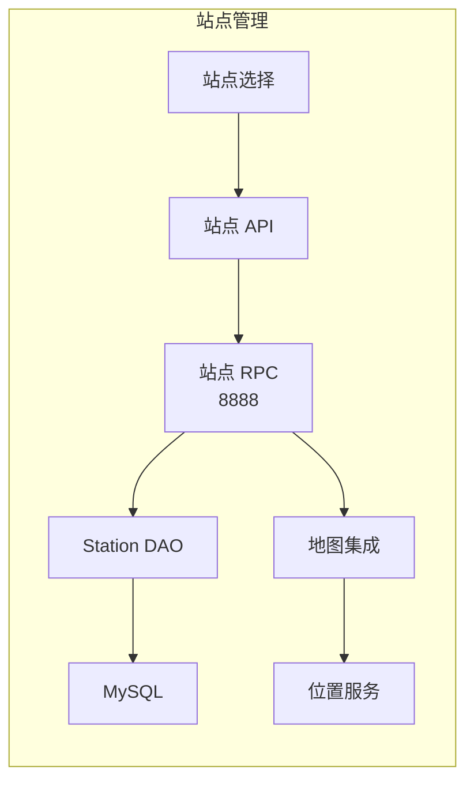
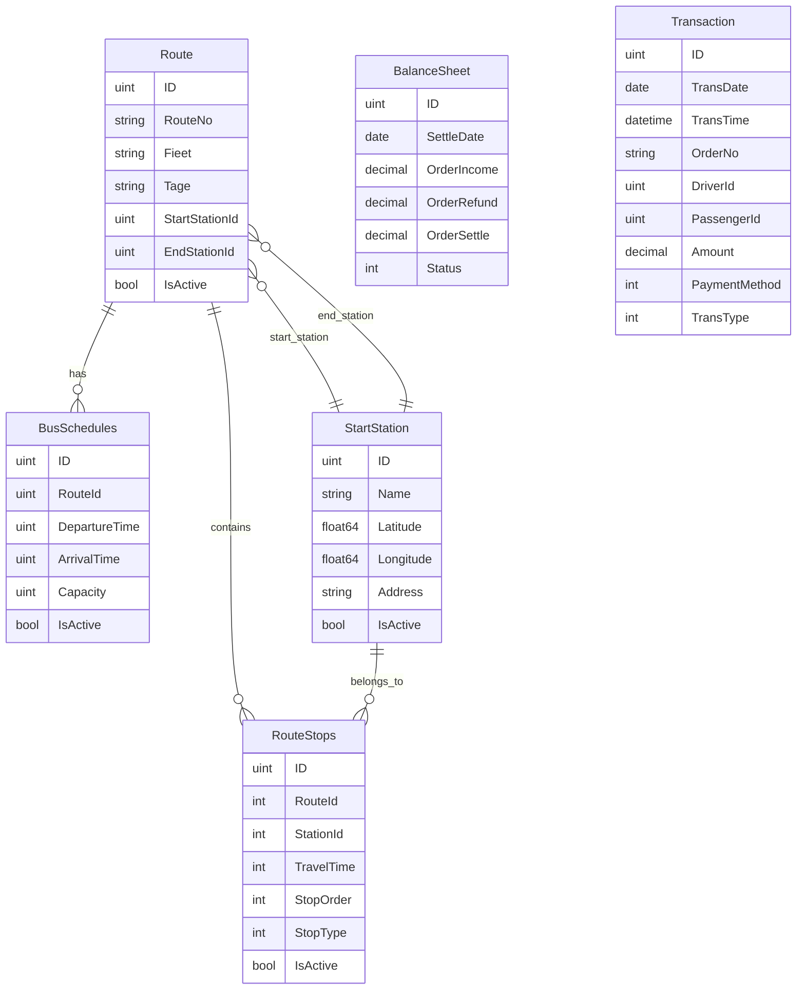
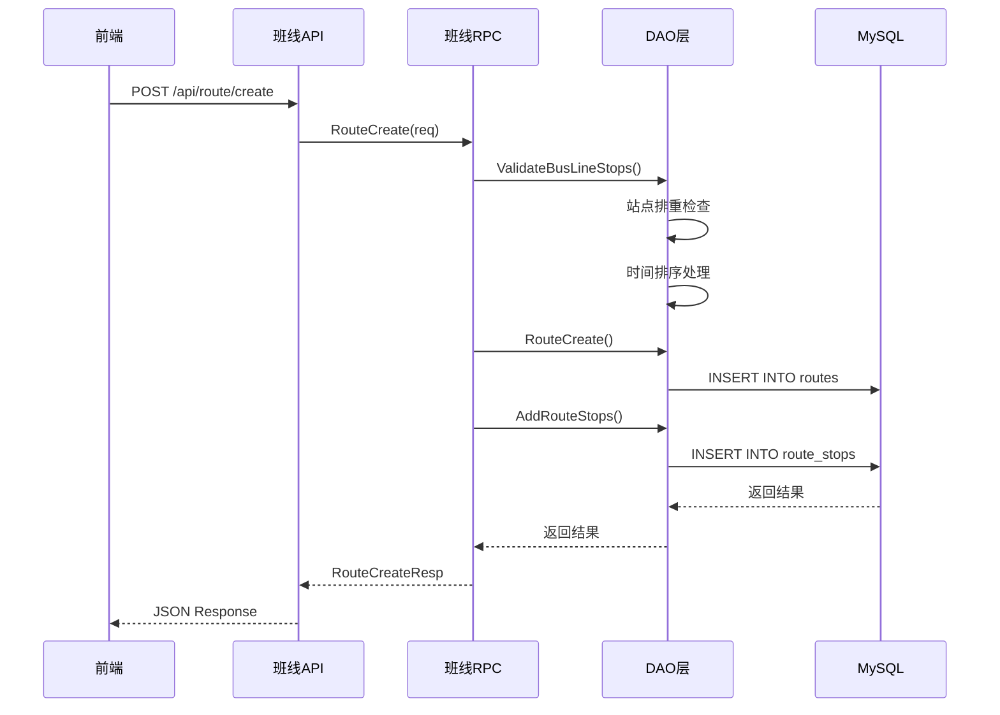
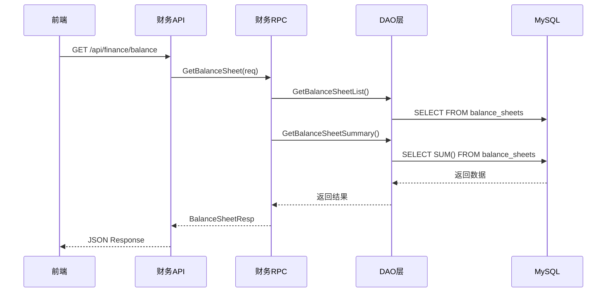
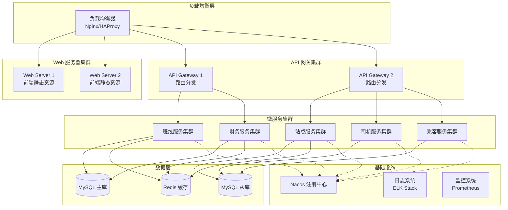

# 拼约出行管理平台架构文档

## 系统架构概览

## 技术栈详情

### 前端技术栈
- **框架**: Vue 3 + Composition API
- **UI 组件库**: Element Plus
- **路由**: Vue Router 4
- **状态管理**: Pinia
- **HTTP 客户端**: Axios
- **构建工具**: Vite
- **开发语言**: JavaScript/TypeScript

### 后端技术栈
- **开发语言**: Go 1.19+
- **RPC 框架**: Kitex (字节跳动)
- **HTTP 框架**: Hertz (字节跳动)
- **IDL**: Thrift
- **ORM**: GORM
- **数据库**: MySQL 8.0
- **配置中心**: Nacos
- **服务注册与发现**: Nacos

## 模块架构详解

### 1. 班线管理模块

**核心功能**:
- 班线 CRUD 操作
- 上下车站点管理（排重、排序）
- 班次管理
- 站点时间自动排序（起点为0）

### 2. 财务管理模块

**核心功能**:
- 收支对账表
- 收入对账表
- 多维度结算（线路、班次、站点、司机）
- 异常交易检测与处理
- 自动账单生成

### 3. 站点管理模块

## 数据模型关系

## 服务通信流程

### 班线创建流程

### 财务对账流程

## 部署架构

## 关键特性

### 1. 微服务架构
- **服务拆分**: 按业务领域拆分为独立的微服务
- **服务通信**: 使用 Kitex RPC 框架进行高性能通信
- **服务注册**: 基于 Nacos 的服务注册与发现

### 2. 数据一致性
- **事务管理**: 使用 GORM 事务确保数据一致性
- **分布式事务**: 关键业务流程采用分布式事务
- **数据同步**: 实时同步交易数据到财务系统

### 3. 高可用设计
- **负载均衡**: 多实例部署，支持水平扩展
- **故障转移**: 服务实例故障自动切换
- **数据备份**: 主从复制，定期备份

### 4. 安全性
- **API 鉴权**: JWT Token 认证
- **数据加密**: 敏感数据加密存储
- **访问控制**: 基于角色的权限控制

### 5. 监控与运维
- **服务监控**: Prometheus + Grafana
- **日志收集**: ELK Stack
- **链路追踪**: Jaeger 分布式追踪
- **健康检查**: 服务健康状态监控

## 性能优化

### 1. 缓存策略
- **Redis 缓存**: 热点数据缓存
- **本地缓存**: 配置信息本地缓存
- **CDN**: 静态资源 CDN 加速

### 2. 数据库优化
- **读写分离**: 主库写入，从库读取
- **索引优化**: 关键字段建立索引
- **分库分表**: 大表水平拆分

### 3. 接口优化
- **批量操作**: 减少数据库交互次数
- **异步处理**: 耗时操作异步执行
- **连接池**: 数据库连接池管理

这个架构设计确保了系统的可扩展性、可维护性和高性能，能够支撑大规模的班车管理业务需求。