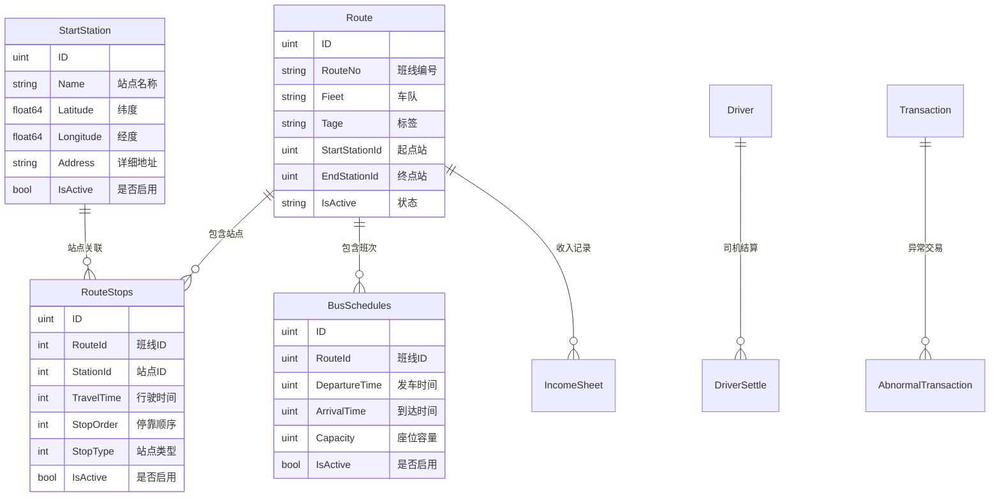

# 拼约出行管理平台系统概览

## 项目结构

```
group/
├── frontend/                    # 前端项目 (Vue 3)
│   ├── src/
│   │   ├── components/         # 公共组件
│   │   ├── views/             # 页面组件
│   │   │   ├── route/         # 班线管理页面
│   │   │   └── finance/       # 财务管理页面
│   │   ├── router/            # 路由配置
│   │   └── api/               # API 接口
│   └── package.json
├── api/                        # HTTP API 层
│   ├── routerApi/             # 班线管理 API (8893)
│   ├── financeApi/            # 财务管理 API (8895)
│   ├── driverApi/             # 司机管理 API (8889)
│   └── passengerApi/          # 乘客管理 API (8890)
├── rpc/                        # RPC 服务层
│   ├── routeRpc/              # 班线 RPC 服务 (8892)
│   ├── financeRpc/            # 财务 RPC 服务 (8894)
│   ├── driverRpc/             # 司机 RPC 服务 (8888)
│   ├── passengerRpc/          # 乘客 RPC 服务 (8888)
│   ├── orderRpc/              # 订单 RPC 服务 (8888)
│   └── starstationRpc/        # 站点 RPC 服务 (8888)
├── handler/                    # 业务逻辑层
│   ├── dao/                   # 数据访问层
│   └── model/                 # 数据模型
├── idl/                        # Thrift IDL 定义
│   ├── route.thrift           # 班线服务定义
│   ├── finance.thrift         # 财务服务定义
│   ├── driver.thrift          # 司机服务定义
│   ├── passenger.thrift       # 乘客服务定义
│   ├── order.thrift           # 订单服务定义
│   └── starstation.thrift     # 站点服务定义
├── kitex_gen/                  # Kitex 生成代码
├── core/                       # 核心配置
│   ├── mysql.go               # MySQL 配置
│   └── naocos.go              # Nacos 配置
├── config/                     # 配置文件
├── global/                     # 全局变量
└── go.mod
```

## 服务端口分配

| 服务类型 | 服务名称 | HTTP API 端口 | RPC 服务端口 | 说明 |
|---------|---------|--------------|-------------|------|
| 前端 | Vue 3 Frontend | 3000 | - | 用户界面 |
| 班线管理 | Route Service | 8893 | 8892 | 班线、站点、班次管理 |
| 财务管理 | Finance Service | 8895 | 8894 | 收支对账、结算管理 |
| 司机管理 | Driver Service | 8889 | 8888 | 司机信息管理 |
| 乘客管理 | Passenger Service | 8890 | 8888 | 乘客信息管理 |
| 订单管理 | Order Service | - | 8888 | 订单处理 |
| 站点管理 | Station Service | - | 8888 | 站点信息管理 |

## 核心业务模块

### 1. 班线管理模块 (Route Management)

**功能特性**:
- ✅ 班线 CRUD 操作
- ✅ 上下车站点配置
- ✅ 站点自动排序（按行驶时间）
- ✅ 站点排重检查
- ✅ 班次管理
- ✅ 线路状态管理

**技术实现**:
- IDL: `idl/route.thrift`
- RPC: `rpc/routeRpc/` (端口 8892)
- API: `api/routerApi/` (端口 8893)
- 前端: `frontend/src/views/route/`

### 2. 财务管理模块 (Finance Management)

**功能特性**:
- ✅ 收支对账表
- ✅ 收入对账表
- ✅ 线路结算表
- ✅ 班次结算表
- ✅ 站点结算表
- ✅ 司机结算表
- ✅ 异常交易检测
- ✅ 自动账单生成
- ✅ 数据导出功能

**技术实现**:
- IDL: `idl/finance.thrift`
- RPC: `rpc/financeRpc/` (端口 8894)
- API: `api/financeApi/` (端口 8895)
- 前端: `frontend/src/views/finance/`

### 3. 站点管理模块 (Station Management)

**功能特性**:
- 站点信息管理
- 地理位置配置
- 站点状态管理
- 地图集成支持

**技术实现**:
- IDL: `idl/starstation.thrift`
- RPC: `rpc/starstationRpc/` (端口 8888)
- 数据模型: `handler/model/starstation.go`

### 4. 司机管理模块 (Driver Management)

**功能特性**:
- 司机信息管理
- 司机认证
- 行程记录
- 收入统计

**技术实现**:
- IDL: `idl/driver.thrift`
- RPC: `rpc/driverRpc/` (端口 8888)
- API: `api/driverApi/` (端口 8889)

### 5. 乘客管理模块 (Passenger Management)

**功能特性**:
- 乘客信息管理
- 乘车记录
- 支付管理
- 评价系统

**技术实现**:
- IDL: `idl/passenger.thrift`
- RPC: `rpc/passengerRpc/` (端口 8888)
- API: `api/passengerApi/` (端口 8890)

### 6. 订单管理模块 (Order Management)

**功能特性**:
- 订单创建与管理
- 支付处理
- 订单状态跟踪
- 退款处理

**技术实现**:
- IDL: `idl/order.thrift`
- RPC: `rpc/orderRpc/` (端口 8888)

## 数据模型设计

### 核心实体关系



## 技术架构特点

### 1. 微服务架构
- **服务拆分**: 按业务领域拆分独立服务
- **RPC 通信**: 使用 Kitex 高性能 RPC 框架
- **API 网关**: HTTP API 层统一对外服务

### 2. 前后端分离
- **前端**: Vue 3 + Element Plus 现代化 UI
- **后端**: Go + Kitex + Hertz 高性能服务
- **通信**: RESTful API + JSON 数据交换

### 3. 数据一致性
- **事务管理**: GORM 事务确保数据一致性
- **业务规则**: 站点排重、时间排序等业务逻辑
- **数据校验**: 多层数据校验机制

### 4. 可扩展性
- **水平扩展**: 微服务独立部署和扩展
- **配置中心**: Nacos 统一配置管理
- **服务发现**: 自动服务注册与发现

## 部署方式

### 开发环境启动顺序

1. **启动数据库**
```bash
# MySQL 数据库
mysql -u root -p
```

2. **启动 RPC 服务**
```bash
# 班线 RPC 服务
cd rpc/routeRpc && go run .

# 财务 RPC 服务  
cd rpc/financeRpc && go run .

# 其他 RPC 服务...
```

3. **启动 API 服务**
```bash
# 班线 API 服务
cd api/routerApi && go run .

# 财务 API 服务
cd api/financeApi && go run .

# 其他 API 服务...
```

4. **启动前端**
```bash
cd frontend && npm run dev
```

### 生产环境部署

- **容器化**: Docker + Docker Compose
- **编排**: Kubernetes 集群部署
- **负载均衡**: Nginx 反向代理
- **监控**: Prometheus + Grafana
- **日志**: ELK Stack

## 核心优势

1. **高性能**: Kitex RPC 框架，性能优异
2. **高可用**: 微服务架构，故障隔离
3. **易维护**: 清晰的分层架构，代码结构规范
4. **易扩展**: 模块化设计，支持水平扩展
5. **用户友好**: 现代化前端界面，操作简便

这个系统架构能够很好地支撑班车管理平台的各种业务需求，具备良好的可扩展性和维护性。